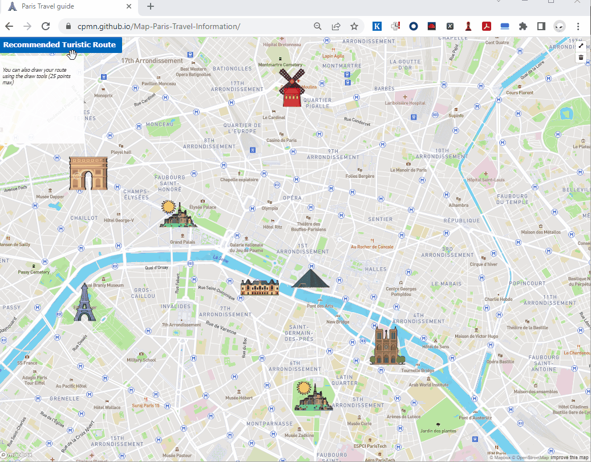

<div align="center" id="top"> 
  
  <a href="https://cpmn.github.io/Map-Paris-Travel-Information/">Demo</a>
</div>

<h1 align="center">Paris Travel guide on Bicycle</h1>

<p align="center">
  <a href="#dart-about">Description</a> &#xa0; | &#xa0; 
  <a href="#dart-about">DEMO</a> &#xa0; | &#xa0; 
  <a href="#sparkles-features">Roadmap</a> &#xa0; | &#xa0;
  <a href="#rocket-technologies">Technologies</a> &#xa0; | &#xa0;
  <a href="#white_check_mark-requirements">Requirements</a> &#xa0; | &#xa0;
  <a href="#checkered_flag-starting">Starting</a> &#xa0; | &#xa0;
  <a href="#memo-license">License</a> &#xa0; | &#xa0;
  <a href="https://github.com/cpmn" target="_blank">Author</a>
</p>

<br>

## :dart: Description ##

This project was made during week 9 of MIT xPRO bootcamp, this is a small project to add animations into Maps using  mapbox framework, the original project from MIT was to walk from MIT univeristy to Harvard University.

I have change the original project having a turistic bicycle guide and recomended and optimal route through the most visited places in Paris City. 

## :dart: DEMO ##

This website is responsive so you can try from you desktop, laptop, mobile or your table.
Enjoy the live [DEMO](https://cpmn.github.io/Map-Paris-Travel-Information/)

## :sparkles: Roadmap ##

These are the list of currect improvements:

:heavy_check_mark: Feature 1: As a turist I would like to see in the map the most visited turistic places in the city of Paris.\
:heavy_check_mark: Feature 2: As a turist I would like to get and optimal route to visit the turistic places in bicycle.\
:heavy_check_mark: Feature 3: As a turist I would like to remove the recommende route.\
:heavy_check_mark: Feature 4: As a turist I would like to build my own route in the map throught the turistic places in Paris.\
:heavy_check_mark: Feature 5: As a turist I would like to remove my route.\
:heavy_check_mark: Feature 6: As a turist I would like to see the distance of routes recomended.\
:heavy_check_mark: Feature 7: As a turist I would like to see the distance of my selected routes.

For future enhancemnts:
- Feature 8: Add a tool tip on mouse over on each historical monument to see the title and the description.
- Feature 9: Enhance the optimal route with an inteligent algorithm.
- Feature 10: Add more historical monuments

Bugs for fix
- Issue 1: if a turist create his own route we need to disable the "recommended button", it is causing some issues at remove the route using the draw tool.

## :rocket: Technologies ##

The following tools were used in this project:

- [HTML](https://www.w3schools.com/html/)
- [CSS](https://www.w3schools.com/css/)
- [JavaScript](https://www.w3schools.com/js/)
- [MapBox](https://docs.mapbox.com/)

## :white_check_mark: Requirements and How to Run ##

Before starting :checkered_flag:, you need to have [Git](https://git-scm.com) installed.

## :checkered_flag: Starting ##

```bash
# Clone this project
$ git clone git@github.com:cpmn/Map-Paris-Travel-Information.git

# Access
$ cd Map-Paris-Travel-Information

# Run index.html in a browser
- [Index.html](index.html)
```
Once the webpage is loaded you will see in the top left corner a button to display de recommended turistic route, after you click a recommended route will be displayed in the map though the histocial places, notice the button will change the label to "Remove recommended turistic route". 
In the top right corner you will see a tool to drow your own route and for remove your rout use the trash icon bellow the draw tool.

## :memo: License ##

This project is under license from MIT. For more details, see the [LICENSE](LICENSE) file.


Made with :heart: by <a href="https://github.com/cpmn" target="_blank">Claudia Muñoz</a>

&#xa0;

<a href="#top">Back to top</a>